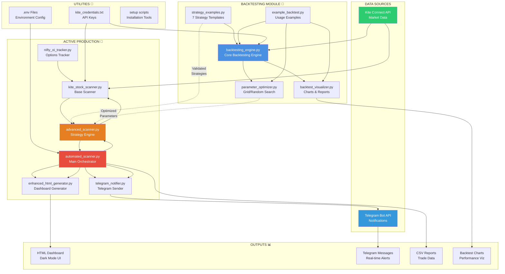
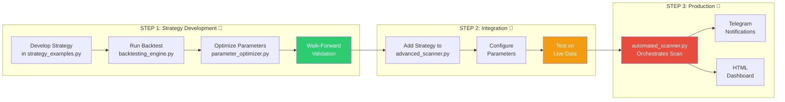
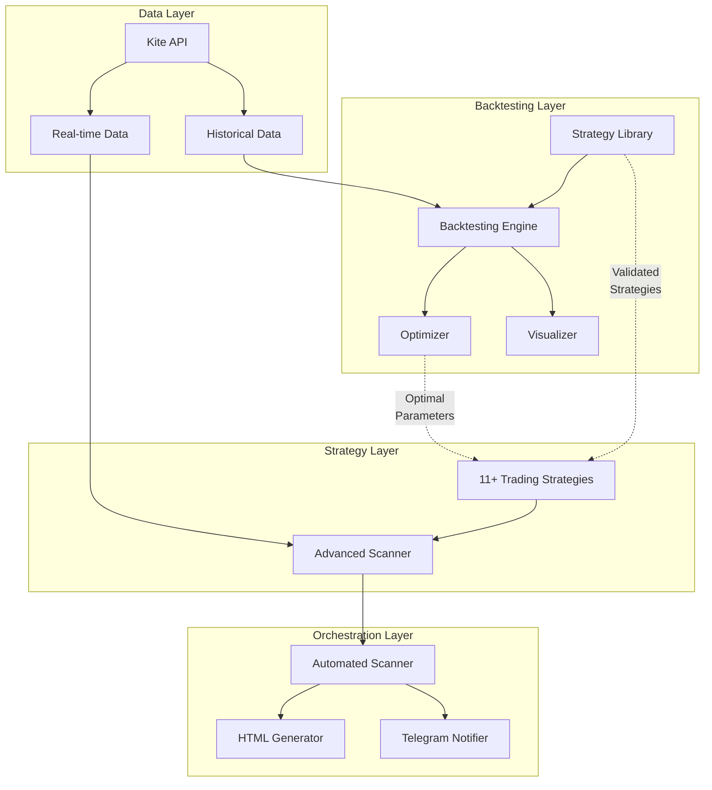

# 🏗️ Complete System Architecture with Backtesting

## System Overview
This document shows the complete system architecture including the Scanner (Active Production), Backtesting, and supporting modules.

---

## 📊 Architecture Diagram



---

## 🔄 Complete Workflow Integration



---

## 📁 Module Interaction Map



---

## 🎯 File Classification by Module

### **Backtesting Module** (8 files)
```
Backtesting/
├── 🎯 CORE (4 files)
│   ├── backtesting_engine.py       ⚙️ Main engine
│   ├── backtest_visualizer.py      📊 Charts
│   ├── parameter_optimizer.py      🔍 Optimization
│   └── strategy_examples.py        📈 Strategies
│
├── 📖 EXAMPLES (1 file)
│   └── example_backtest.py         🎓 Tutorial
│
├── 📚 DOCS (2 files)
│   ├── README.md
│   └── QUICKSTART.md
│
└── 📋 CONFIG (1 file)
    └── requirements (2).txt
```

### **Active Production** (6 files)
```
Active_Production/
├── automated_scanner.py            🤖 Main orchestrator
├── advanced_scanner.py             📊 Strategy engine
├── telegram_notifier.py            📱 Notifications
├── enhanced_html_generator.py      🌐 Dashboard
├── kite_stock_scanner.py          🔌 API wrapper
└── nifty_oi_tracker.py            📈 Options tracker
```

### **Utilities** (5 files)
```
Utilities/
├── setup_telegram.py
├── generate_token.py
├── check_nifty_token.py
├── quick_token.py
└── enhanced_html_generator.py
```

### **Archive** (4 files)
```
Archive/
├── closing_momentum_scanner.py
├── eth_swing_screener.py
├── kite_stock_scanner.py
└── Profitable_strategy_scanner.py
```

---

## 🔧 Key Integration Points

### 1. **Strategy Flow**
```
Backtesting/strategy_examples.py
          ↓
  [Backtest & Optimize]
          ↓
Active_Production/advanced_scanner.py
          ↓
  [Live Scanning]
          ↓
Telegram Alerts + HTML Dashboard
```

### 2. **Data Flow**
```
Kite API
    ├─→ Historical Data → Backtesting
    └─→ Real-time Data → Scanner
                              ↓
                        Results/
                              ├─→ HTML Dashboard
                              ├─→ CSV Reports
                              └─→ Telegram Alerts
```

### 3. **Configuration Flow**
```
kite_credentials.txt
        ↓
[Both Modules Use Same Credentials]
        ↓
    Kite API Access
```

---

## 📊 Process Flow Comparison

### **Backtesting Process:**
1. Load historical data (Kite API)
2. Run strategy on historical data
3. Calculate performance metrics
4. Optimize parameters (grid/random search)
5. Validate with walk-forward analysis
6. Generate visualizations
7. Export results

### **Live Scanning Process:**
1. Load real-time data (Kite API)
2. Apply validated strategies
3. Filter signals (7-day window)
4. Deduplicate (latest signal per stock)
5. Send Telegram notifications
6. Generate HTML dashboard
7. Save CSV results

---

## 🎯 Usage Scenarios

### **Scenario 1: New Strategy Development**
```
1. Create strategy in strategy_examples.py
2. Run example_backtest.py
3. Review visualizations
4. Optimize parameters if needed
5. Validate with walk-forward
6. Add to advanced_scanner.py
7. Test live with automated_scanner.py
```

### **Scenario 2: Existing Strategy Optimization**
```
1. Extract strategy from advanced_scanner.py
2. Create backtest version
3. Run parameter_optimizer.py
4. Find optimal parameters
5. Update scanner with new parameters
6. Monitor live performance
```

### **Scenario 3: Performance Analysis**
```
1. Export live trading results (CSV)
2. Load into backtesting_engine.py
3. Generate performance reports
4. Compare with backtest expectations
5. Adjust strategy if needed
```

---

## 🚀 Quick Start Paths

### **For Backtesting:**
```bash
cd Backtesting
python example_backtest.py
```

### **For Live Scanning:**
```bash
cd StockTrader
python Active_Production\automated_scanner.py
```

### **For Strategy Development:**
```bash
# 1. Edit strategy
Backtesting/strategy_examples.py

# 2. Test it
Backtesting/example_backtest.py

# 3. Deploy it
Active_Production/advanced_scanner.py
```

---

*System Integration Complete - Ready for Strategy Development & Live Trading*
